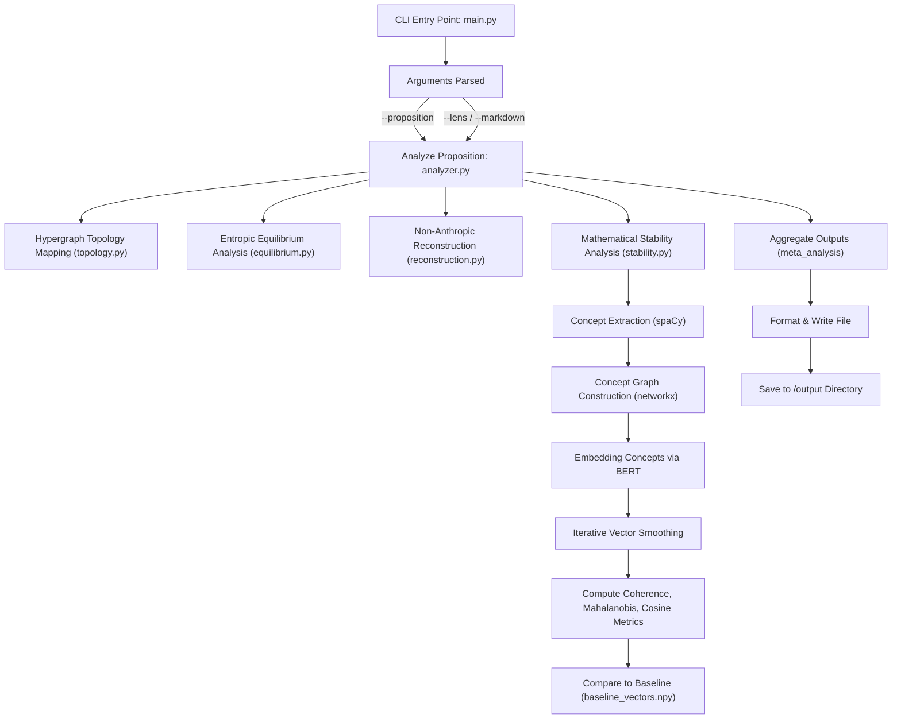
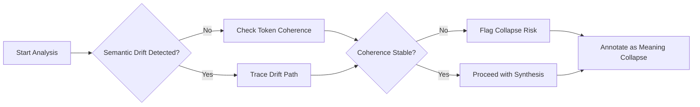

# 📐 Hypergraph Epistemology Pipeline Overview

This document outlines the internal architecture of the Hypergraph Epistemology CLI tool, illustrating how a natural language `proposition` is analyzed across multiple semantic, structural, and statistical dimensions. The analysis is distributed across distinct phases, each simulating a mode of epistemological critique, mathematical modeling, or post-human interpretation.

## High-Level Flow



---

## Hypergraph Collapse Check


---

## 🧾 Input

* The system accepts a single **natural language proposition** string.
* Optional flags:

  * `--lens`: Apply specific epistemological lenses (Haraway, Barad, Foucault, Spivak).
  * `--markdown`: Output the result in Markdown format.

---

## 🔍 Meta-Analytic Phases

These modules use `run_ollama()` to prompt a local language model with special epistemological instructions:

### 1. `hypergraph_topology_mapping(proposition, lens_context)`

Analyzes:

* Hidden assumptions
* Cognitive regimes and structures
* Power relations and metaphysical commitments

### 2. `entropic_equilibrium_analysis(proposition, lens_context)`

Asks whether the proposition:

* Stabilizes or disrupts cognition
* Resists or absorbs perturbation
* Aligns with or defies cultural forces

### 3. `non_anthropic_reconstruction(proposition, lens_context)`

Reframes the proposition from:

* Alien, post-human, or multispecies epistemologies
* Rejects anthropocentric logic or agency

---

## 🧮 Mathematical Stability Phase

### 🧠 Linguistic Parsing

* `spacy` parses the proposition into **concepts**: nouns, verbs, and adjectives.
* A **graph `G`** is built where nodes = concepts, and edges = dependency links.

### 🔗 Vector Embedding via BERT

* Each concept token is embedded via `bert-base-uncased` using the final hidden state.
* Concept vectors are stored in a dictionary: `{concept → embedding vector}`

### 🔁 Graph Diffusion

* Concept embeddings are **averaged with neighbors** over 10 iterations to model contextual semantic entanglement.
* Mimics how meaning stabilizes across a cognitive field.

### 📊 Metrics Computed

* **Internal Coherence**: Average cosine similarity across graph edges.
* **Contrastive Cosine**: Each concept's average cosine similarity to `baseline_vectors.npy`.
* **Mahalanobis Distance**: Statistical deviation of each concept's embedding from the baseline distribution trained via `EmpiricalCovariance`.

### 🔐 Baseline Vector Reference

* `baseline_vectors.npy` must exist in `data/`.
* It contains canonical embedding representations of well-formed factual propositions.

---

## 🧪 Output Report

Each proposition yields:

* 📌 *Hypergraph Topology Mapping*
* 🌀 *Entropic Equilibrium Analysis*
* 👽 *Non-Anthropic Reconstruction*
* 📉 *Stability Metrics*

  * Node and edge counts
  * Internal cosine coherence
  * Contrast-to-baseline cosine
  * Mahalanobis dispersion
  * Per-concept scores
* 💡 *Synthesized Output*

Formatted into:

* `output/analysis_001.md` or `.txt`, depending on the CLI flag

---

## 📂 File Structure Summary

```
main.py                     → CLI entry point
analyzer.py                 → Orchestrates multi-phase analysis
phases/
├── topology.py             → Meta-structural topology lens
├── equilibrium.py          → Entropic resistance/stability lens
├── reconstruction.py       → Alien epistemology lens
├── stability.py            → Graph + BERT + Mahalanobis analyzer
├── mahalanobis.py          → Mahalanobis model + distance utils
├── __init__.py             → Phase package initializer
llm/
└── ollama.py               → Wrapper for local LLM prompting
data/
└── baseline_vectors.npy    → Precomputed baseline concept embeddings
```

---

## ❓ FAQ

### Does the `proposition` get embedded?

Yes. In the `stability.py` phase:

* The proposition is tokenized.
* Concept tokens (nouns, verbs, adjectives) are embedded via BERT.
* These are compared to baseline vectors using cosine and Mahalanobis metrics.

### Why use Mahalanobis distance?

It captures **non-linear variance** from a trained distribution of known-factual embeddings, offering a richer signal than cosine alone.

### What if `baseline_vectors.npy` is missing?

You must run `build_baseline.py` to generate it before running the CLI tool.

---

## 🧠 Philosophical Intent

This system is designed to simulate a **multi-perspectival epistemological engine**:

* It treats meaning as **structural persistence under recursive perturbation**.
* It blends **statistical modeling, linguistic theory, and critical philosophy**.
* It aims to construct an **inference-level hypergraph** of the proposition's internal topology, cultural load, and cognitive entanglement.

---


